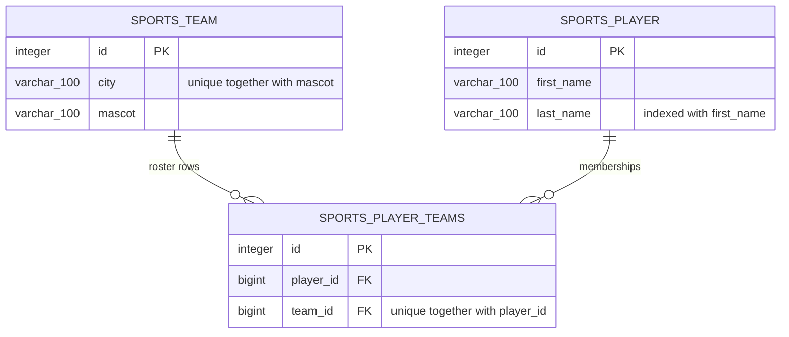

# Sports Roster

Teams have a city and a mascot, players have a name, and a player can appear on
more than one team's roster. That is the entire domain. It is a Django 4.2
application: class-based views, server-rendered Bootstrap templates, SQLite, and
a login in front of everything.

**On the name:** this was a coding exercise for a company called *E2E
Innovations* — the brand in the navbar of every page below. Nothing here is an
end-to-end test harness and nothing drives a browser in CI. `E2E` is the client,
not the technique.

## The four screens

Captured with Playwright at 1440x900 against a local server seeded by
`manage.py seed_demo_data`.

| Teams, with roster size per row | One team and its roster |
| --- | --- |
|  |  |

| Players and the teams they play for | Adding a player |
| --- | --- |
|  |  |

## Teams, players, and the rows between them

Two tables plus the join table Django creates for the many-to-many:



Three rules live in the database rather than in form validation, all added by
migration `0002_roster_relations_and_indexes`:

- `unique_team_city_mascot` — a city/mascot pair can only exist once, so
  duplicate clubs are rejected by the engine.
- `player_name_idx` on `(last_name, first_name)` — that pair is the ordering of
  the player list and therefore of its paginator.
- the join table's unique index on `(player_id, team_id)`, which Django adds for
  the many-to-many, so a player cannot be on the same roster twice.

One naming detail matters more than it looks: `Player.teams` declares
`related_name='players'`, which is what makes `team.players.all` resolve in
`team_detail.html`. See [what the regression tests pin](#what-the-regression-tests-pin).

## Run it

`requirements.txt` is Django 4.2.30, its two runtime dependencies, and gunicorn.
Nothing in it needs a C compiler, so the install works on current CPython — the
app is developed and tested on Python 3.12.

```bash
python3 -m venv .venv && source .venv/bin/activate
pip install -r requirements.txt

export DJANGO_SECRET_KEY="$(python -c 'from django.core.management.utils import get_random_secret_key as k; print(k())')"
python manage.py migrate
python manage.py seed_demo_data          # 5 teams, 10 players, user demo
python manage.py runserver 127.0.0.1:8500
```

Open <http://127.0.0.1:8500/> and sign in as `demo` / `demo-password-123`.

`DJANGO_SECRET_KEY` is not optional: with `DJANGO_DEBUG` off the settings module
raises `ImproperlyConfigured` on import and the process refuses to start rather
than signing sessions and CSRF tokens with a value from the repository.

With `DEBUG` off you also get the real error pages — `handler404` and
`handler500` in `sportsapp/urls.py` point at `custom_404_view` and
`custom_500_view`, which render `404.html` and `500.html` with HTTP 404 and 500
respectively. The two templates are separate pages with their own wording.

### In a container

`Dockerfile` is multi-stage on `python:3.12-slim` (wheels built in the builder
stage so no compiler ships), runs as a non-root `app` user, keeps SQLite on a
named volume at `/data`, migrates on start, serves through gunicorn, and has a
`HEALTHCHECK` against `/healthz/`.

**It has never been built or booted.** The uplift report for this repo records
`Build verified: NOT RUN — deferred, Docker off` and `Boot verified: NOT RUN —
deferred, Docker off`; the only Docker check that was actually run is
`docker compose config`, which parsed cleanly. Treat the following as unverified:

```bash
export DJANGO_SECRET_KEY="$(python -c 'from django.core.management.utils import get_random_secret_key as k; print(k())')"
docker compose up --build        # publishes on http://localhost:8500/
```

Compose fails fast if `DJANGO_SECRET_KEY` is unset, by design.

## Settings that come from the environment

`sportsapp/settings.py` reads every environment-dependent value from
`os.environ`. `.env.example` is a fillable copy.

| Variable | Required | Default | Purpose |
| --- | --- | --- | --- |
| `DJANGO_SECRET_KEY` | Yes | none | Signs sessions, CSRF tokens and password-reset links. Startup fails without it when `DJANGO_DEBUG` is off. |
| `DJANGO_DEBUG` | No | `0` | Django's debug pages and tracebacks. Local use only. |
| `DJANGO_ALLOWED_HOSTS` | No | `localhost,127.0.0.1,[::1]` | Comma-separated `ALLOWED_HOSTS`. Not a wildcard. |
| `DJANGO_CSRF_TRUSTED_ORIGINS` | No | empty | Comma-separated origins allowed to POST. Needed behind a proxy or on a non-default port. |
| `DJANGO_SECURE_SSL` | No | `0` | Switches on HTTPS redirect, secure cookies, HSTS and the forwarded-proto header. |
| `DJANGO_DB_PATH` | No | `<repo>/db.sqlite3` | Where the SQLite file lives. The container sets `/data/db.sqlite3`. |
| `DJANGO_LOG_LEVEL` | No | `INFO` | Root log level. Logs go to stdout. |
| `SPORTS_PAGE_SIZE` | No | `25` | Rows per page on both list views. |
| `WEB_PORT` | No | `8500` | Host port published by `docker-compose.yml`. |
| `GUNICORN_WORKERS` | No | `3` | Worker count inside the container. |

## Where the queries live

`sports/views.py` never builds a queryset. Each view names a template and calls
`sports/selectors.py`, which owns prefetching, annotation and ordering; a shared
`PaginatedListView` reads the page size from settings at request time so both
lists paginate identically.

The reason is the player list. Its template renders each player's teams, and on
a plain queryset that costs one extra query per row. `scripts/benchmark_roster.py`
renders the real template against both querysets and prints the comparison;
[`docs/benchmark.txt`](docs/benchmark.txt) is its committed output (Django
4.2.30, Python 3.12.6, SQLite, macOS arm64):

```
  rows |  naive q  naive ms |  selector q  selector ms
    50 |       51      22.7 |           2          4.1
   200 |      201      45.1 |           2         14.2
  1000 |     1001     202.9 |           2         75.8
```

At a thousand players that is **1001 queries against 2**, and roughly 203 ms of
render time against 76 ms. Re-run the script yourself and the query columns come
back identical — they are structural; the millisecond columns drift by a few ms
per run, so read them as an order of magnitude rather than a benchmark score.

The team list had the same shape of problem waiting: it shows a roster size per
team, which now comes from a single `Count` annotation. Three tests in
`sports/tests/test_performance.py` hold the line, including
`test_player_list_queries_do_not_grow_with_the_number_of_rows`, which asserts the
count is the same at 5 rows and at 25.

No cache layer. Two queries per page against an indexed table is not worth one,
and `selectors.py` is where a cache would go if that ever changed.

## What the regression tests pin

Two failures in this app were invisible rather than loud, and both now have a
named test whose docstring records what broke:

- **`/player/<pk>/` renders a real page.** `PlayerDetailView` names
  `player_detail.html`; that template exists and shows the player with the teams
  they belong to. `test_player_detail_renders` documents that the template had
  never been written, so every "Details" link on the player list was a 500.
- **A team detail page lists its roster.** `test_team_detail_lists_the_roster`
  and `test_team_exposes_players_reverse_accessor` document the failure mode:
  without `related_name='players'` the reverse accessor was `player_set`, and a
  Django template swallows the attribute error silently — so the page reported
  "No players on this roster yet" for a team that provably had players, with no
  exception and no log line.

The second one is worth remembering as a category: a template that reads the
wrong attribute does not fail, it renders an empty truth.

## Working on the code

```bash
pip install -r requirements-dev.txt

# the suite imports settings the way a deployment does, so it needs a key too
export DJANGO_SECRET_KEY="$(python -c 'from django.core.management.utils import get_random_secret_key as k; print(k())')"

pytest                 # 44 tests
ruff check .
ruff format .

DJANGO_SECURE_SSL=1 python manage.py check --deploy
DJANGO_DEBUG=1 python scripts/benchmark_roster.py
```

`check --deploy` comes back clean with a generated key. A short or
`django-insecure-`-prefixed one trips `security.W009`, which is the check doing
its job. Transcripts of these commands are in
[`docs/test-run.txt`](docs/test-run.txt).

```
sportsapp/          project: settings (all env-driven), root URLs, WSGI/ASGI
sports/
  models.py         Team and Player, ordering, index, uniqueness constraint
  selectors.py      every queryset in the app
  views.py          thin class-based views, plus the /healthz/ probe
  forms.py          model forms, whitespace trimming, Bootstrap widgets
  migrations/       0001 initial, 0002 relations and indexes
  management/commands/seed_demo_data.py   idempotent demo fixture
  tests/            models, auth, views, performance, settings
templates/sports/   base.html, one template per page, _form and _pagination partials
scripts/            benchmark_roster.py
docs/               screenshots and command transcripts
```

Templates load Bootstrap 5.3.3 from a CDN with subresource-integrity hashes;
there are no static assets of our own to collect and no JavaScript beyond
Bootstrap's bundle.

## Deliberately out of scope

- **No API.** Everything is server-rendered HTML. `/healthz/` is the only JSON
  endpoint, and it exists for the container healthcheck.
- **No authorisation model.** Any signed-in user can edit or delete any team or
  player. No roles, no ownership, no audit trail.
- **Open signup.** Anyone who can reach the app can create an account — no
  invitation, no email verification.
- **No search or filtering**, only pagination.
- **SQLite and one process.** Fine for a single instance; several gunicorn
  workers writing at once will contend on the database lock. Moving to
  PostgreSQL is a `DATABASES` change and nothing else, since no raw SQL or
  backend-specific feature is used anywhere.
- **No statistics, fixtures or seasons.** The domain stops at teams, players and
  the membership between them.
