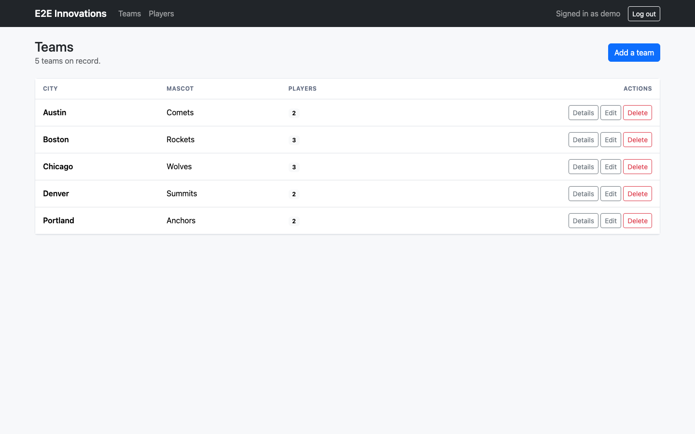
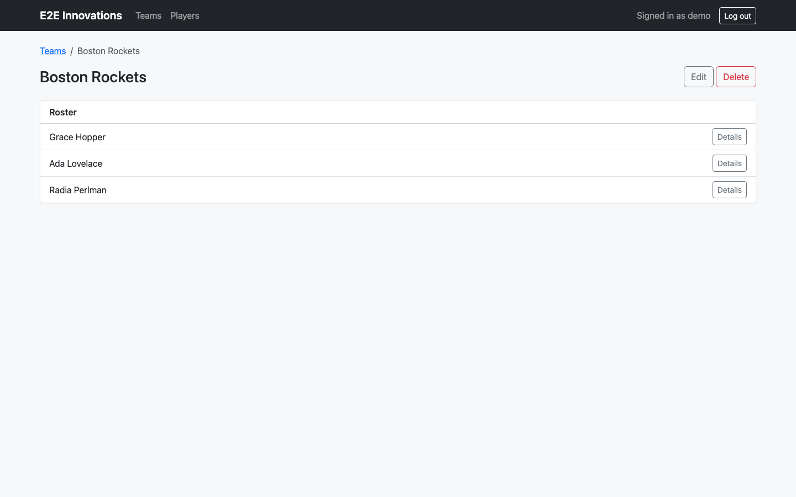
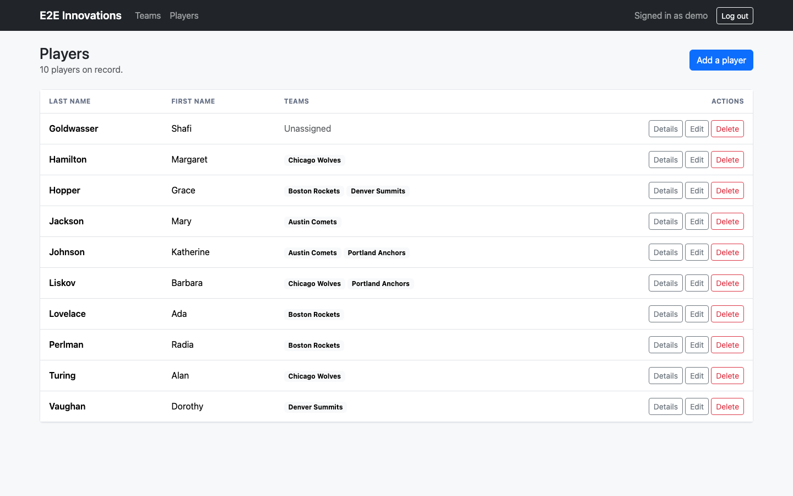
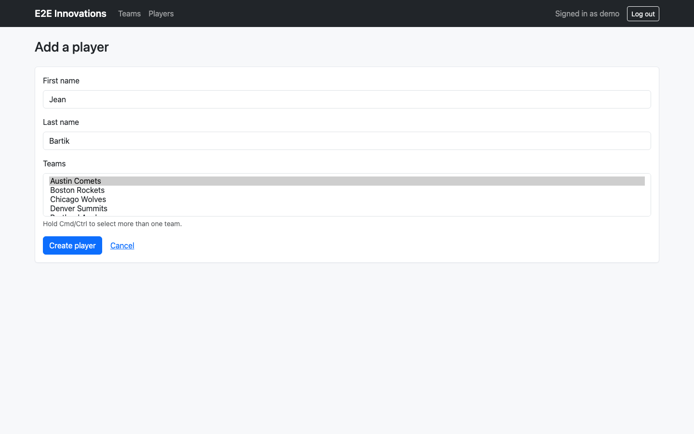
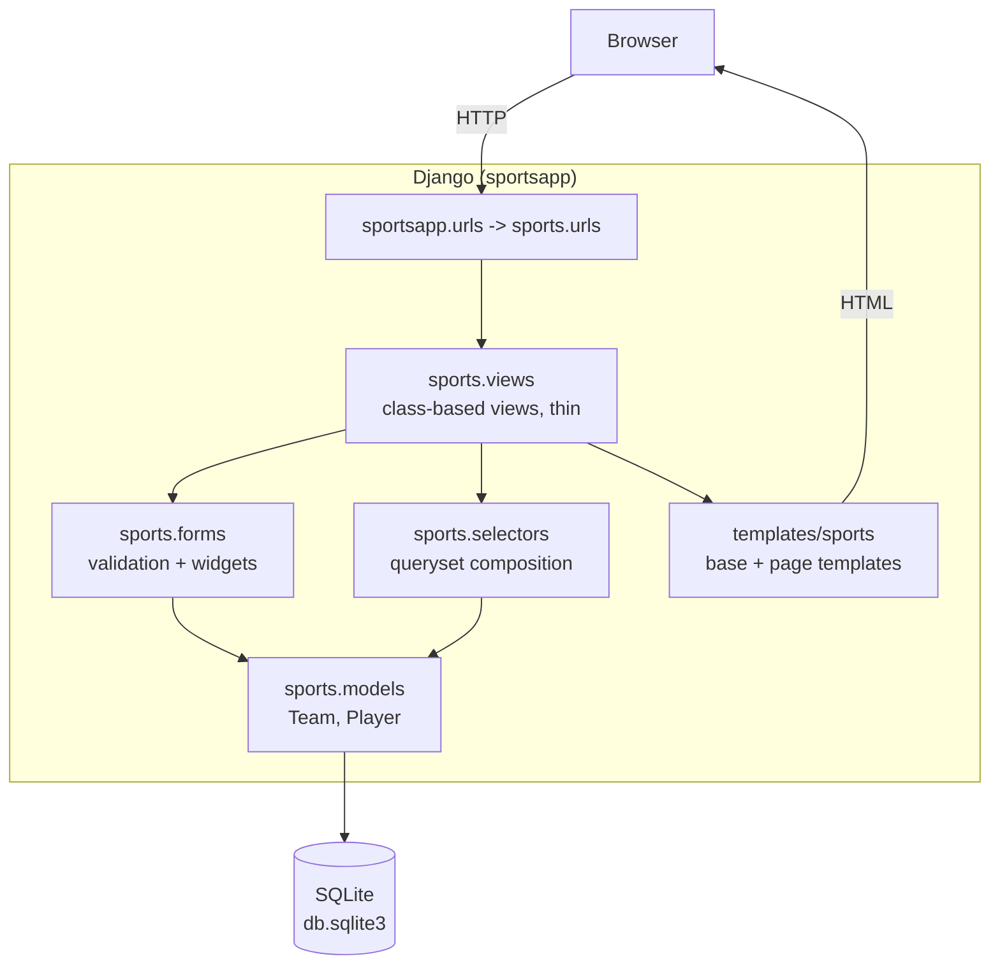
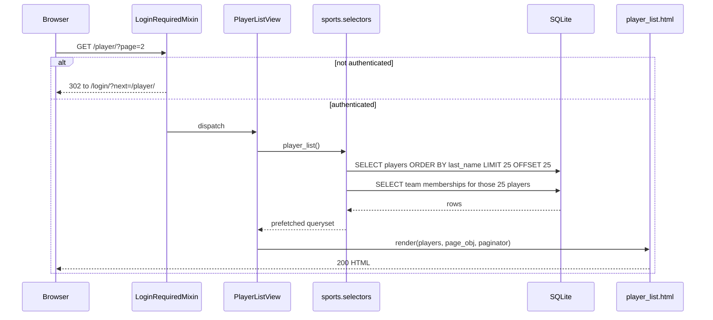

# Sports Roster

A small Django application for keeping club rosters: teams have a city and a
mascot, players have a name, and a player can appear on more than one team's
roster. Everything behind the login is CRUD over those two models, rendered
server-side with Django's class-based views and Bootstrap.

It was written as a coding exercise for E2E Innovations, so it stays
deliberately narrow: no API layer, no background jobs, no third-party services.

## Screenshots

Captured with Playwright at 1440x900 against a local server seeded by
`python manage.py seed_demo_data`.

| Teams | Team detail |
| --- | --- |
|  |  |

| Players | Player form |
| --- | --- |
|  |  |

## Architecture



Dependencies point inward: templates and views know about selectors and forms;
selectors know about models; models know about nothing above them. No view
builds a queryset by hand, and no template reaches past the context it is given.

## Request flow

The player list is the page with the most moving parts, so it is the one worth
tracing:



## Quickstart

```bash
python3 -m venv .venv && source .venv/bin/activate
pip install -r requirements.txt

export DJANGO_DEBUG=1              # dev only; supplies a throwaway SECRET_KEY
python manage.py migrate
python manage.py seed_demo_data    # demo / demo-password-123
python manage.py runserver 8500
```

Then open <http://127.0.0.1:8500/> and log in as `demo`.

With Docker:

```bash
export DJANGO_SECRET_KEY="$(python -c 'from django.core.management.utils import get_random_secret_key as k; print(k())')"
docker compose up --build       # serves on http://localhost:8500/
```

The container runs migrations on start and serves through gunicorn, not
`runserver`. SQLite lives on a named volume so the data survives a rebuild.

## Configuration

Every environment-dependent value is read from the environment; nothing
sensitive is committed. See `.env.example`.

| Variable | Required | Default | Purpose |
| --- | --- | --- | --- |
| `DJANGO_SECRET_KEY` | Yes, unless `DJANGO_DEBUG=1` | none | Signing key for sessions, CSRF and password resets. Startup fails without it when `DJANGO_DEBUG` is off. |
| `DJANGO_DEBUG` | No | `0` | Turns on Django's debug pages and a throwaway development secret key. Never enable in a deployment. |
| `DJANGO_ALLOWED_HOSTS` | No | `localhost,127.0.0.1,[::1]` | Comma-separated `ALLOWED_HOSTS`. |
| `DJANGO_CSRF_TRUSTED_ORIGINS` | No | empty | Comma-separated origins allowed to POST, needed behind a proxy or a non-default port. |
| `DJANGO_SECURE_SSL` | No | `0` | Turns on HTTPS redirect, secure cookies and HSTS. Enable wherever TLS terminates in front of the app. |
| `DJANGO_DB_PATH` | No | `<repo>/db.sqlite3` | Filesystem path of the SQLite database. The container sets it to `/data/db.sqlite3`. |
| `DJANGO_LOG_LEVEL` | No | `INFO` | Root log level; logs go to stdout. |
| `SPORTS_PAGE_SIZE` | No | `25` | Rows per page on the team and player lists. |
| `WEB_PORT` | No | `8500` | Host port published by `docker-compose.yml`. |
| `GUNICORN_WORKERS` | No | `3` | Worker count inside the container. |

## Development

```bash
pip install -r requirements-dev.txt

pytest                 # 44 tests
ruff check .           # lint
ruff format .          # format

DJANGO_SECURE_SSL=1 DJANGO_SECRET_KEY=... python manage.py check --deploy
DJANGO_DEBUG=1 python scripts/benchmark_roster.py     # query-count benchmark
```

Real output from those commands is in [`docs/test-run.txt`](docs/test-run.txt)
and [`docs/benchmark.txt`](docs/benchmark.txt).

## Project structure

```
sportsapp/            Django project: settings, URLs, WSGI/ASGI entrypoints
  settings.py         All environment-dependent config, read from os.environ
sports/               The one application
  models.py           Team and Player, plus ordering, index and uniqueness rules
  selectors.py        Queryset composition: prefetching, annotation, ordering
  views.py            Thin class-based views; no queryset logic lives here
  forms.py            Model forms, whitespace normalisation, Bootstrap widgets
  urls.py             Route table, including the /healthz/ probe
  admin.py            Admin registrations for both models
  management/commands/seed_demo_data.py    Idempotent demo fixture
  migrations/         0001 initial, 0002 relations and indexes
  tests/              pytest suite (models, auth, views, performance, settings)
templates/sports/     base.html plus one template per page; _form and _pagination partials
scripts/              benchmark_roster.py
docs/                 Captured screenshots and command transcripts
```

## Design notes

**Thin views over a selectors layer.** The original views each set `model` and
let Django build the queryset, which meant every query decision was implicit and
scattered. `sports/selectors.py` now owns queryset composition and the views
call it. That is where the prefetching and the annotation live, it is directly
unit-testable, and adding a filter or a search later touches one module.

**The real bottleneck was an N+1 on the player list.** The list template renders
each player's teams, and with a plain queryset that is one extra query per row.
Measured with `scripts/benchmark_roster.py` (Django 4.2.30, Python 3.12.6,
SQLite):

```
  rows |  naive q  naive ms |  selector q  selector ms
    50 |       51      22.7 |           2          4.1
   200 |      201      45.1 |           2         14.2
  1000 |     1001     202.9 |           2         75.8
```

`prefetch_related('teams')` makes the query count constant at 2 regardless of
roster size. The team list had the same shape of problem in waiting — rendering
a roster size per team — so it uses a `Count` annotation rather than a per-row
count. Both are guarded by tests that assert an exact query count, plus one that
asserts the count does not change between 5 and 25 rows.

**Pagination before caching.** An unbounded list view is the failure mode that
actually bites this app, so both lists paginate at `SPORTS_PAGE_SIZE`. A cache
would be premature: with two queries per page and an index on the sort columns,
there is nothing here worth caching yet.

**Configuration moved out of the source.** `SECRET_KEY` was committed, `DEBUG`
was hardcoded and `ALLOWED_HOSTS` was `["*"]`. All three now come from the
environment, and the app refuses to start with `DEBUG` off and no key rather
than falling back to a known value. `manage.py check --deploy` passes clean with
`DJANGO_SECURE_SSL=1`.

**The extension seam is the selectors module.** It is the one place a future
developer genuinely needs: filtering, searching, or moving the roster read to a
different store all happen there without touching a view, a form or a template.

**SQLite is a deliberate choice, not a leftover.** The dataset is two tables and
a join table, the access pattern is a handful of indexed reads per request, and
the original exercise shipped with SQLite. Swapping in PostgreSQL is a
`DATABASES` change and nothing else, because no raw SQL or backend-specific
feature is used anywhere.

## Limitations

- **No API.** Everything is server-rendered HTML; there is no JSON endpoint
  other than `/healthz/`.
- **No authorisation model.** Any authenticated user can edit or delete any team
  or player. There are no roles, owners or audit trail.
- **SQLite and a single process.** Fine for one instance; concurrent writes from
  several gunicorn workers will contend on the database lock. Move to PostgreSQL
  before scaling out.
- **No search or filtering** on the list pages, only pagination.
- **Signup is open.** Anyone who can reach the app can create an account; there
  is no email verification or invitation flow.
- **Player statistics, fixtures and seasons are out of scope.** The domain is
  deliberately just teams, players and the membership between them.
